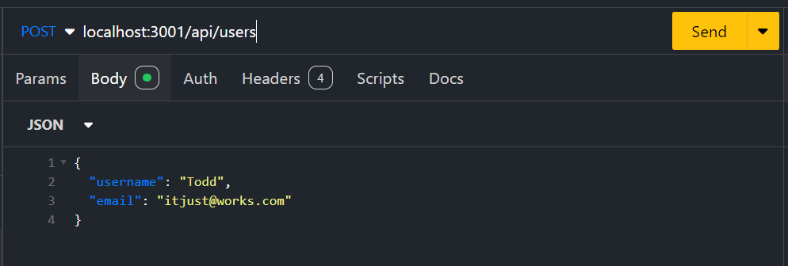
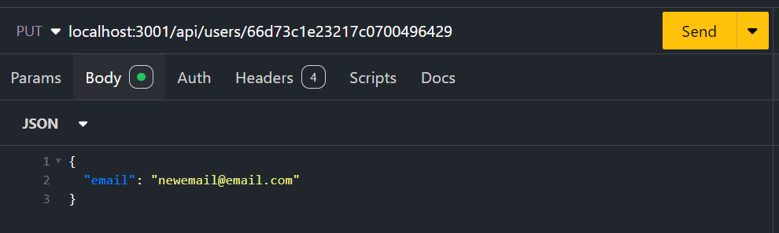
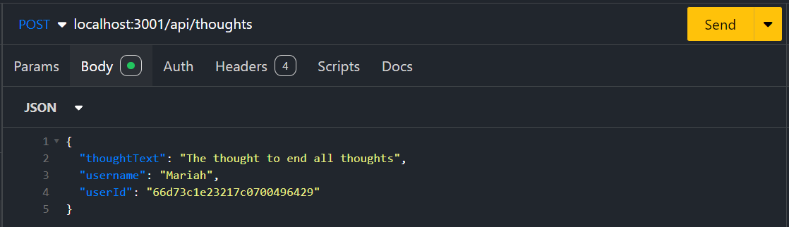
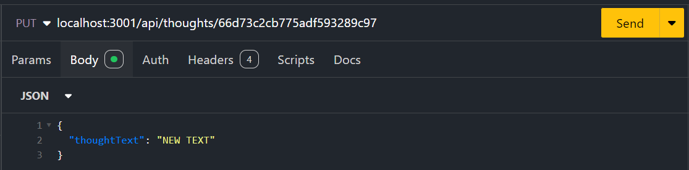
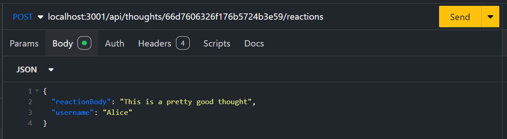
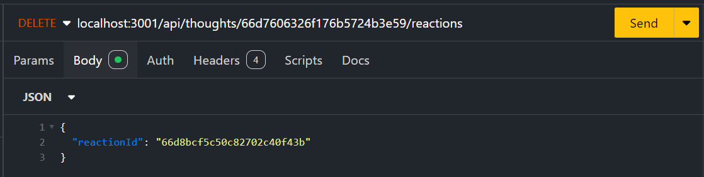

# Social-Networking-18

## Description:

This repo was created to showcase a basic API with MongoDB for a social network app where users can share thoughts, add friends, and react to friend's thoughts.

## Installation:

Run 'npm i' in your terminal to install the necessary dependencies, run 'node seed.js' in the utils folder to seed the test data, then use 'node server.js' to run the application.

## Usage:

To use this repo, run 'node server.js' in your terminal, then refer to the following information to learn about what actions you can perform with Insomnia or an equivalent app:

### 1. localhost:3001/api/users

GET Request: returns all users  

POST Request: creates a new user with the following:  
{ "username": "new username here",  "email": "new email here" }

### 2. localhost:3001/api/users/:id

:id would be the ID of the user you want to see, update, or delete

GET Request: returns a single user  

PUT Request: updates a single user with any or all of the following:  
{ "username": "new username here",  "email": "new email here" }  

DELETE Request: deletes a single user

### 3. localhost:3001/api/users/:userId/friends/:friendId

:userId would be the ID of the user you want to add or remove friends from 
:friendId is the ID of the user you want to add or remove from the friend list

POST Request: adds a single friend to a single user  

DELETE Request: removes a single friend from a single user

### 4. localhost:3001/api/thoughts

GET Request: returns all thoughts  

POST Request: creates a new thought with the following:  
{ "thoughtText": "content of new thought here",  "username": "user's username here",  "userId": "ID of user to attach thought to" }

### 5. localhost:3001/api/thoughts/:thoughtId

GET Request: returns a single thought  

PUT Request: updates a single thought with any or all of the following:  
{ "thoughtText": "content of updated thought here",  "username": "user's username here",  "userId": "ID of user to attach thought to" }  

DELETE Request: deletes a single thought

### 6. localhost:3001/api/thoughts/:thoughtId/reactions

:thoughtId is the ID of the thought to add or remove reactions from

POST Request: adds reaction to a thought with the following: 
{ "reactionBody": "content of reaction goes here", 
"username": "name of user making reaction here" } 
 
DELETE Request: removes reaction from a thought with the following: 
{ "reactionId": "ID of reaction to remove here" } 

## Credits:

Josh Stringer

## License:

Refer to the LICENSE in the repo.

## Link To Demo Video:
